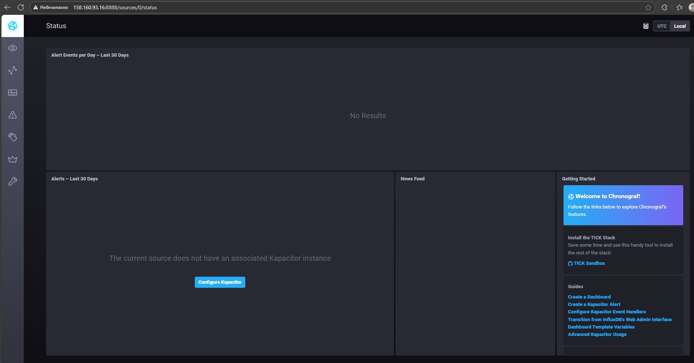
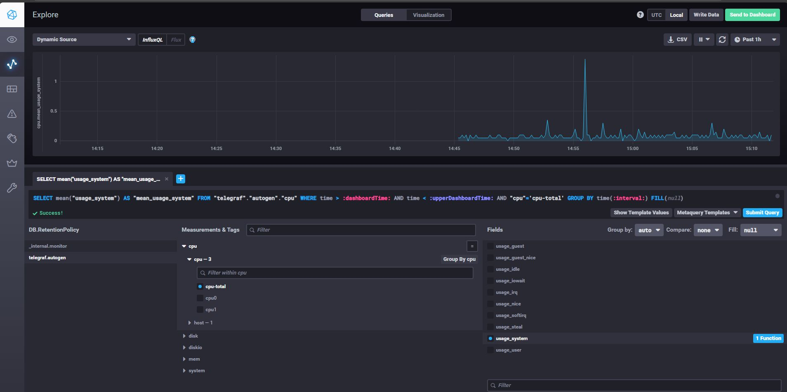
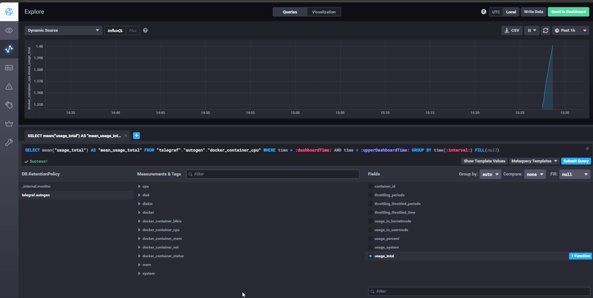

# Домашнее задание к занятию "13.Системы мониторинга" - Лебедев В.В. FOPS-33

## Обязательные задания

1. Вас пригласили настроить мониторинг на проект. На онбординге вам рассказали, что проект представляет из себя 
платформу для вычислений с выдачей текстовых отчетов, которые сохраняются на диск. Взаимодействие с платформой 
осуществляется по протоколу http. Также вам отметили, что вычисления загружают ЦПУ. Какой минимальный набор метрик вы
выведите в мониторинг и почему?

## Решение 1

| Категория | Метрика | Обоснование |
| :--- | :--- | :--- |
| **Доступность/Произв.** | HTTP Rate (R) | Нагрузка на систему. |
| | HTTP Error Rate (E) | Доля ошибок (4xx/5xx). |
| | HTTP Latency (D) | Время ответа (P95, P99). |
| **Ресурсы (Критично)** | CPU Utilization (Load Average) | Вычисления загружают ЦПУ, это узкое место. |
| | RAM Usage | Предотвращение OOM. |
| | Disk Space Free | Место для сохранения отчетов. |
| **Приложение** | In-flight Jobs | Количество активных вычислений. |
| | Write Latency | Время сохранения отчетов на диск. |

#
2. Менеджер продукта посмотрев на ваши метрики сказал, что ему непонятно что такое RAM/inodes/CPUla. Также он сказал, 
что хочет понимать, насколько мы выполняем свои обязанности перед клиентами и какое качество обслуживания. Что вы 
можете ему предложить?

## Решение 2

Предлагаем дашборд на основе SLO, а не ресурсов:

1. **"Качество Обслуживания" (Доступность):**
   * Метрика: `% Успешных HTTP-запросов (2xx)` за период.
   * Что это значит: Насколько часто клиенты могут пользоваться платформой.

2. **"Отзывчивость Платформы" (Latency):**
   * Метрика: `% Запросов, выполненных быстрее, чем X секунд` (например, P90 < 2с).
   * Что это значит: Как быстро клиент видит результат.

3. **"Выполнение Обязательств" (Throughput Success):**
   * Метрика: `% Успешно сгенерированных и сохраненных отчетов` от общего числа запросов.
   * Что это значит: Фактическая выполненная работа.

*(Технические метрики (CPU/RAM) будут использоваться SRE для диагностики проблем, но не выводиться менеджеру.)*

#
3. Вашей DevOps команде в этом году не выделили финансирование на построение системы сбора логов. Разработчики в свою 
очередь хотят видеть все ошибки, которые выдают их приложения. Какое решение вы можете предпринять в этой ситуации, 
чтобы разработчики получали ошибки приложения?

## Решение 3

В условиях отсутствия бюджета на централизованную систему (ELK/Loki):

1. **Немедленный доступ (для стектрейсов):**
   * Настроить ограниченный SSH-доступ.
   * Разработчики используют `grep`/`awk` по лог-файлам (`tail -f /var/log/app.log`) для просмотра ошибок в реальном времени.

2. **Долгосрочное хранение (архивация):**
   * Настроить `cron job`, который сжимает старые логи и **загружает их в уже существующее облачное хранилище** (S3, Azure Blob) в пределах бесплатных лимитов.

3. **Критические ошибки как метрики:**
   * Разработчики оборачивают критические ошибки в экспорт метрики в существующий Prometheus (например, `app_critical_errors_total{type="db"}`).
   * Преимущество: Ошибки будут видны в Grafana немедленно, хотя и без полного стектрейса.

#
4. Вы, как опытный SRE, сделали мониторинг, куда вывели отображения выполнения SLA=99% по http кодам ответов. 
Вычисляете этот параметр по следующей формуле: summ_2xx_requests/summ_all_requests. Данный параметр не поднимается выше 
70%, но при этом в вашей системе нет кодов ответа 5xx и 4xx. Где у вас ошибка?

## Решение 4

Ошибка кроется в наборе данных для знаменателя или числителя.

$$\text{SLA} = \frac{\text{summ\_2xx\_requests}}{\text{summ\_all\_requests}}$$

**Если 4xx=0 и 5xx=0, то $\text{SLA}$ всегда равно 100%.**

**Где ошибка:**
1. **Неучтенные неудачи:** В `summ_all_requests` (знаменатель) вы считаете *все события* (например, все попытки запуска вычислений), а в `summ_2xx_requests` (числитель) — только *успешные HTTP-ответы*. Если вычисление падает внутри (до HTTP ответа), оно попадает в знаменатель, но не в числитель, тем самым понижая SLA.
2. **Неправильная фильтрация:** Вы ошибочно классифицируете какие-то неудачные события (которые должны быть 4xx/5xx) как 2xx, или наоборот.

#
5. Опишите основные плюсы и минусы pull и push систем мониторинга.

## Решение 5

### Pull-система (Пример: Prometheus)

| Плюсы | Минусы |
| :--- | :--- |
| **Централизованный контроль:** Сборщик точно знает, что и когда опрашивать. | **Задержка:** Задержка сбора = интервал опроса (scrape interval). |
| **Простота Service Discovery:** Легче находить новые цели. | **Не подходит для ephemeral-хостов:** Быстро появляющиеся/исчезающие цели могут быть пропущены. |
| **Устойчивость клиента:** Сбой клиента не ломает сам сервер мониторинга. | **Нагрузка на сервер:** Большое количество целей может перегрузить сборщик запросами. |

### Push-система (Пример: Graphite/Telegraf)

| Плюсы | Минусы |
| :--- | :--- |
| **Низкая задержка:** Метрики отправляются немедленно после генерации. | **Слабый контроль:** Сервер мониторинга не знает, если цель перестала отправлять данные (молчание не считается ошибкой). |
| **Идеально для ephemeral-хостов:** Клиент сам инициирует отправку, когда он жив. | **Сложность обнаружения (Discovery):** Требуется внешняя логика для управления отправкой. |
| **Меньше нагрузки на сервер:** Сервер только слушает, а не инициирует запросы. | **Риск перегрузки сервера:** Внезапный всплеск отправлений может обрушить приемный сервер. |

#
6. Какие из ниже перечисленных систем относятся к push модели, а какие к pull? А может есть гибридные?

    - Prometheus 
    - TICK
    - Zabbix
    - VictoriaMetrics
    - Nagios
	
## Решение 6

| Система | Модель сбора данных | Примечание |
| :--- | :--- | :--- |
| **Prometheus** | Pull (Вытягивание) | Основная модель — опрос (scraping). |
| **TICK Stack (Telegraf)** | Push (Отправка) | Telegraf отправляет метрики в InfluxDB. |
| **Zabbix** | Гибридная (Pull-ориентированная) | Поддерживает как опрос (пассивный/активный агент), так и отправку (трапперы). |
| **VictoriaMetrics** | Pull (Вытягивание) | Совместима с Prometheus, использует модель опроса. |
| **Nagios** | Pull (Вытягивание) | Классическая модель по расписанию. |

#
7. Склонируйте себе [репозиторий](https://github.com/influxdata/sandbox/tree/master) и запустите TICK-стэк, 
используя технологии docker и docker-compose.

В виде решения на это упражнение приведите скриншот веб-интерфейса ПО chronograf (`http://localhost:8888`). 

P.S.: если при запуске некоторые контейнеры будут падать с ошибкой - проставьте им режим `Z`, например
`./data:/var/lib:Z`

## Решение 7



#
8. Перейдите в веб-интерфейс Chronograf (http://localhost:8888) и откройте вкладку Data explorer.
        
    - Нажмите на кнопку Add a query
    - Изучите вывод интерфейса и выберите БД telegraf.autogen
    - В `measurments` выберите cpu->host->telegraf-getting-started, а в `fields` выберите usage_system. Внизу появится график утилизации cpu.
    - Вверху вы можете увидеть запрос, аналогичный SQL-синтаксису. Поэкспериментируйте с запросом, попробуйте изменить группировку и интервал наблюдений.

Для выполнения задания приведите скриншот с отображением метрик утилизации cpu из веб-интерфейса.

## Решение 8



#
9. Изучите список [telegraf inputs](https://github.com/influxdata/telegraf/tree/master/plugins/inputs). 
Добавьте в конфигурацию telegraf следующий плагин - [docker](https://github.com/influxdata/telegraf/tree/master/plugins/inputs/docker):
```
[[inputs.docker]]
  endpoint = "unix:///var/run/docker.sock"
```

Дополнительно вам может потребоваться донастройка контейнера telegraf в `docker-compose.yml` дополнительного volume и 
режима privileged:
```
  telegraf:
    image: telegraf:1.4.0
    privileged: true
    volumes:
      - ./etc/telegraf.conf:/etc/telegraf/telegraf.conf:Z
      - /var/run/docker.sock:/var/run/docker.sock:Z
    links:
      - influxdb
    ports:
      - "8092:8092/udp"
      - "8094:8094"
      - "8125:8125/udp"
```

После настройке перезапустите telegraf, обновите веб интерфейс и приведите скриншотом список `measurments` в 
веб-интерфейсе базы telegraf.autogen . Там должны появиться метрики, связанные с docker.

Факультативно можете изучить какие метрики собирает telegraf после выполнения данного задания.

## Решение 9



### Как оформить ДЗ?

Выполненное домашнее задание пришлите ссылкой на .md-файл в вашем репозитории.

---
